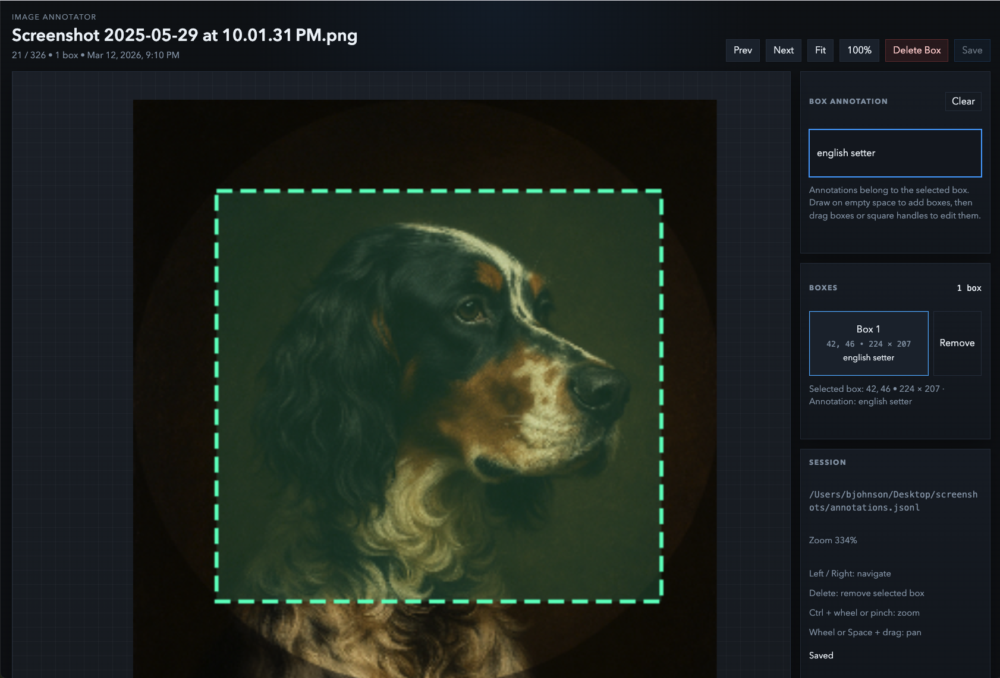

# QLab

QLab is a small local image annotation tool.

Point it at a directory of images and it opens a browser UI where you can:

- draw multiple bounding boxes
- resize and move boxes
- add an annotation to each box
- move between images with the arrow keys



## Install

```bash
pip install "git+https://github.com/jataware/qlab.git"
```

## Run

```bash
qlab /path/to/images
```

Optional:

```bash
qlab /path/to/images --output /path/to/annotations.jsonl --port 8765 --no-browser
```

## Output

QLab writes annotations to `annotations.jsonl` by default. Each line is one image, with a `bboxes` array. Each box stores:

- `x`
- `y`
- `width`
- `height`
- `annotation`
